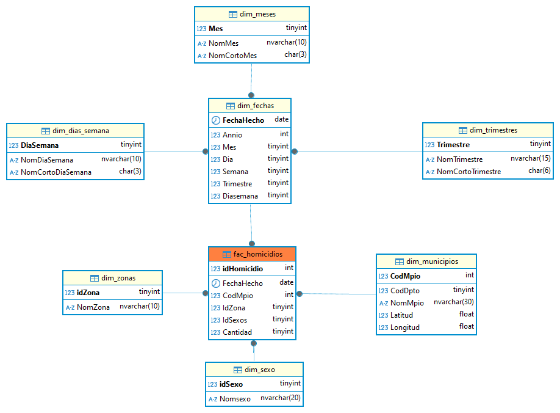

# Data Warehouse
Diseño de un almacen central de datos con modelado de dimensiones y hechos para el análisis de los Homicidios en Colombia.

1. Scripts: Contiene el código SQL de las tablas que almacenarán los datos extraídos, transformados y cargados desde el Data Lake.
2. Modelo ER: Modelo Entidad Relación de Copo de Nieve del Data Warehouse.

